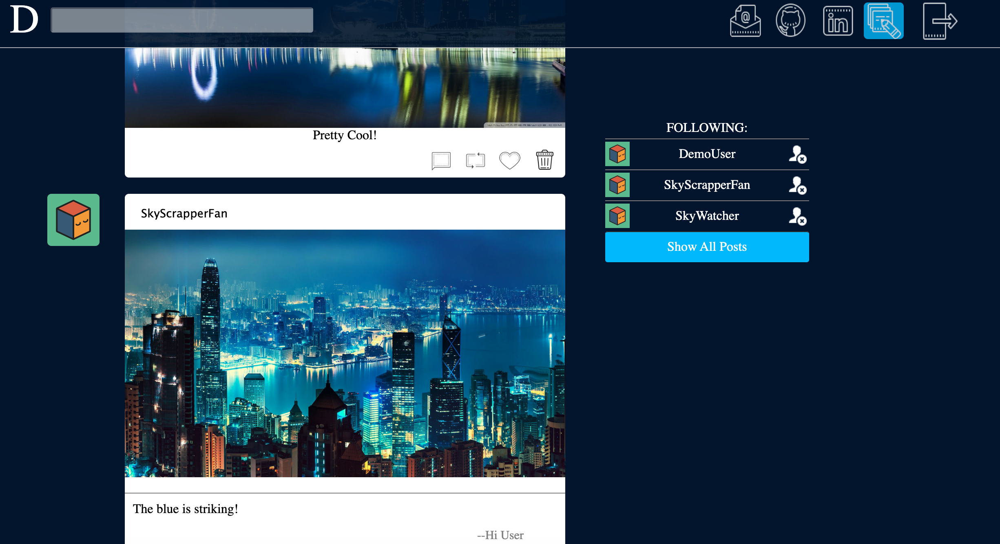
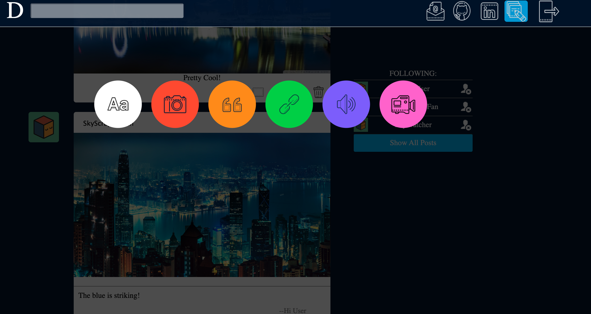
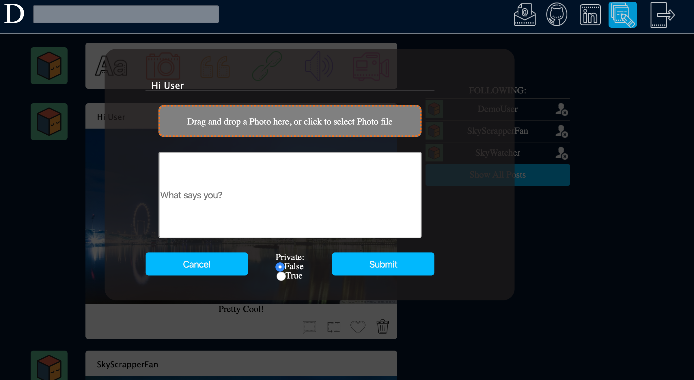

# Dumblr

[Live website](https://fspdumblr.herokuapp.com/#/)


## Description

Dumblr is a Tumblr inspired media sharing and social networking site that allow users to upload and share text, images, audio and video files with other users. Users can comment on other's posts and engage in a dialogue. In addition, users can start following other users and filter their feeds based on user selection. 

Dumblr is a full stack application with both full frontend and backend components. The app uses CRUD(Create Read Update and Delete) functionalities with RESTful API. It uses relational database to store users inputs and stores more bandwidth intensive media content on Amazon Web Services S3.


## Technologies

Dumblr is built primarily with the following technologies:

* React
* Redux
* Jquery 
* BCrypt
* Ruby on Rails
* PosgreSQL
* AWS
* CSS
* Heroku

## Feature
* Secure frontend to backend user authentication using BCrypt
* Users navigation bar changes dependent on login status
* Users are able to post various media content type.
* Users can upload private contents only visible to owner.
* Users can like individual posts.
* Users can follow other users and filter feed based on selection.
* Users can comment on posts.


## Screenshots

Landing page:


Content Feed:



Posting Modal:


Content Posting:



## Code Snippets:

* React Dom Router Setup:

```javascript

     return(

      <div className="MAIN">
      <Modal />
      <header className="main-header">
        <NavbarContainer />
      </header>
      <div className= {`${setting}`} style= {backgroundImage} >
         
          <Switch>
            <ProtectedRoute path ="/dashboard" component={DashboardContainer}/>
            <ProtectedRoute path  ="/logout" component={LogoutContainer}/>
            <AuthRoute exact path="/login" component={LogInFormContainer} />
            <AuthRoute exact path="/signup" component={SignUpFormContainer} />
            <AuthRoute  path="/" component ={SplashContainer}/>
          </Switch>
       </div>
      

       <footer className="main-footer">
     
       </footer>
      
    </div>

    );


```

* Universial Modal Implementation:

```javascript

    function Modal({ modal, content, closeModal }) {

        if (!modal) {
            return null;
        }
        let component;
        switch (modal) {

            case 'createPost':
            component = <CreatePostContainer contentType={content} />;
            break;
            case 'postingModal':
            component = <PostingModalContainer />;
            break;
            case 'showContent':
            component = <ShowContent content={content} />
            break;
            case 'postComment':
            component = <CommentPostContainer content={content} />
            break;
        
            default:
            return null;
        }
        return (
            <div className="modal-background" onClick={closeModal}>
            <div className="modal-child" onClick={e => e.stopPropagation()}>
                {component}
            </div>
            </div>
        );
    }
```

Content posting submission:

```javascript

  handleSubmit(e) {
    e.preventDefault();
    const formData = new FormData();
    formData.append('post[body]', this.state.body);
    formData.append('post[author_id]', this.state.author_id);
    formData.append('post[hashtags]', this.state.hashtags);
    formData.append('post[private]',this.state.private);

    if (this.state.contentFile) {
      formData.append('post[content]', this.state.contentFile);
    }

    $.ajax({
      url: '/api/posts',
      method: 'POST',
      data: formData,
      contentType: false,
      processData: false
    })
      .then(posts => (dispatch(getAllPosts(posts))))
      .then(this.props.closeModal())
  }


```


## Future Implementation:
* Users can search public posts.
* Users can customized profiles.
